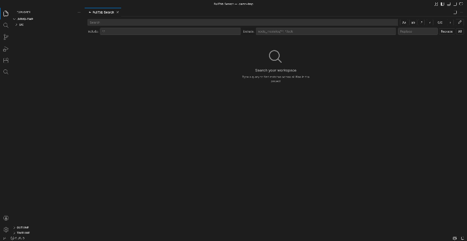

# FullTab Search

Project search in a full editor tab — with inline, editable results. Search your whole workspace, see matches with syntax-highlighted context, and edit them right there in the results, multi-buffer style like Zed.

Available on the [VS Code Marketplace](https://marketplace.visualstudio.com/items?itemName=benjih.fulltab-search) and [Open VSX](https://open-vsx.org/extension/benjih/fulltab-search).



## Why

The sidebar search panel is cramped: a narrow column of truncated lines, with no room for context and no way to act on what you find. FullTab Search gives project search the full editor area instead — results read like code, and in edit mode they *are* code you can change and save without ever opening the files.

## Features

### Edit results inline — like Zed's multi-buffer

Toggle **edit mode** and every result line becomes editable:

- Press **Escape** to revert an uncommitted change
- Press **Ctrl/Cmd+S** to save all pending edits to disk

Edits go through VS Code's standard workspace edit API, so they show up as normal unsaved changes and are fully undoable.

### Search

- **Ripgrep-powered** — fast full-workspace search
- **Match case, whole word, and regex** toggles
- **Include / exclude filters** — comma-separated glob patterns (e.g. `src/**`, `node_modules/**, *.lock`)
- Results update as you type, with state persisted across sessions

### Results that read like code

- Matches grouped by file with file icons and relative paths
- **Syntax-highlighted** match and context lines, using VS Code's TextMate grammars
- **Breadcrumbs** — the enclosing function, class, or type shown above each match
- **Expandable context** — reveal more lines before or after any match group
- Click any match to jump to the exact line and column in the source file

### Find and replace

- Replace the current match or all matches across the workspace
- Replacements apply through workspace edits — safe and undoable

## Getting started

1. Install the extension from the [VS Code Marketplace](https://marketplace.visualstudio.com/items?itemName=benjih.fulltab-search) or [Open VSX](https://open-vsx.org/extension/benjih/fulltab-search)
2. Open it via the **FullTab Search** icon in the activity bar, or run **FullTab Search: Open Project Search** from the Command Palette

### Keyboard shortcuts (inside the search panel)

| Shortcut | Action |
|----------|--------|
| `F4` / `Ctrl+G` | Next match |
| `Shift+F4` / `Shift+Ctrl+G` | Previous match |
| `Ctrl/Cmd+S` | Save pending edits (edit mode) |
| `Enter` / `Backspace` / `Escape` | Split line / join lines / revert edit (edit mode) |

## Settings

| Setting | Default | Description |
|---------|---------|-------------|
| `fullTabSearch.debug` | `false` | Log performance metrics to the FullTab Search output channel |

## Notes and limitations

- Searches the first folder of the workspace (multi-root workspaces use the first root)
- Results are capped at 10,000 matches; the status bar indicates when results are truncated
- Requires VS Code 1.85 or later

## Development

Want to hack on the extension? Clone the [repository](https://github.com/benjih/vscode-fulltab-search) — it uses [devbox](https://www.jetify.com/devbox) for Node 22 and a Makefile for common tasks:

```bash
make install            # npm install
make build              # compile TypeScript
make lint               # type-check + biome + knip
make test               # unit (Vitest) + integration (Mocha in Extension Host)
make test-ui            # Selenium UI tests (needs a display; CI uses xvfb)
make package            # build a .vsix
make demo-gif           # re-record docs/demo.gif via a scripted UI test
```

Press **F5** in VS Code to launch an Extension Development Host with the extension loaded.

The extension host (`src/`) spawns ripgrep, parses its JSON output, and applies edits via workspace edits; the webview UI (`media/`) renders results and talks to the host over `postMessage`.

## License

See the repository for license information.
